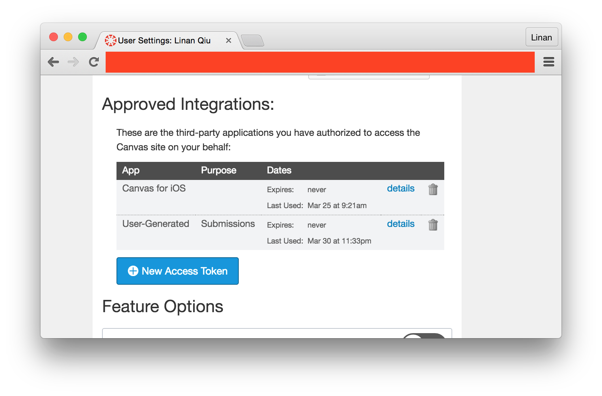

# Canvas Submission Time Scraper

Canvas is kind of clunky when it comes to exporting data. Furthermore, many profs like to give grace days / hours / minutes (because they're nice people unlike me) even after submissions are due. Then, they'll have to manually mark submissions as "on-time" even though Canvas marks them late.

Canvas **currently does not export student assignment submission times**. That can be annoying for classes / professors / TAs that work on a grace day system (like mine). Wouldn't it be nice to export each student's submission time as a CSV file for a given assignment?

This is what we do.

## Dependencies

- Python >=2.7, with module [requests](https://github.com/kennethreitz/requests) ( + [grequests](https://github.com/kennethreitz/grequests) if using async version)
    - Resolve dependencies via: `pip2/pip3 install --user -r requirements.txt`


### Usage

First of all, clone this repo to be able to run `canvas-panda.py`. Why did I name it panda? Because I am a panda.

#### Getting an Access Token

Obtain the Canvas **access token** from your user Settings .

For example, in Columbia Uni:

1. Log in to courseworks2 at [https://courseworks2.columbia.edu/](https://courseworks2.columbia.edu/) and get yourself an **access token** by going to settings:


2. And get yourself a new access token. **Copy it down**.




#### Running the Script

```bash
$ python3 canvas-panda-async.py -h

usage: canvas-panda-async.py [-h] [-u CANVAS_URL] [--timezone TIMEZONE]
                             [--date-format {col_US,rmit_AUS}]
                             canvas_api_key course_id assignment_id

Grabs submission times for an assignment in a course.

positional arguments:
  canvas_api_key        Canvas API Key obtained from "settings"
  course_id             Course ID. e.g. xxxx in
                        https://<canvas_url>/courses/xxxx/assignments/yyyy
  assignment_id         Course ID. e.g. yyyy in
                        https://<canvas_url>/courses/xxxx/assignments/yyyy

optional arguments:
  -h, --help            show this help message and exit
  -u CANVAS_URL, --canvas_url CANVAS_URL
                        Canvas base URL (default: rmit.instructure.com)
  --timezone TIMEZONE   Timezone to used (default: Australia/Melbourne) (see h
                        ttp://en.wikipedia.org/wiki/List_of_tz_database_time_z
                        ones)
  --date-format {col_US,rmit_AUS}
                        Format of the submission date+time to be used
                        (default: %-d/%-m/%Y %-H:%-M:%-S)
```

You can find the Course ID and Assignment ID from the URL of the assignment: `https://<canvas_url>/courses/xxxx/assignments/yyyy` where `xxxx` is the course ID and `yyyy` is the assignment ID.


For example:

```bash
python3 canvas-panda-async.py -u rmit.instructure.com --date-format col_US  \
    --timezone Canada/Central 95952pcHw2i8gJB9AGjs5XphYS5SZmR0AXWgWuDm05Nmcqk4uL 12533 176110
```

The results will be saved in a .csv file with these columns:

- Student's name (if available)
- Student's UNI (if available)
- Students `user_id` (used by Canvas)
- Student's submission time (following date format used)


## Issues

Unfortunately, we are not able to cross reference UNIs from student names and student IDs because Canvas. You'll have to cross reference them on your own from gradebook exports. That's trivial using either spreadsheet functions (`VLOOKUP`) or a simple script.

              .;;.
             /;;;;\  ___      .;;.
            |;(;;;-""   `'-.,;;;;;\
             \;'            ';;;);/
             /                \;;'
            /    .;.   .;.     \
            |   ;;o;; ;;o;;    |
            ;   '"-'` `'-"'    |
            /\      ._.       /
          ;;;;;_   ,_Y_,   _.'
         /;;;;;\`--.___.--;.
        /|;;;;;;;.__.;;;.  \\
       ;  \;;;;;;;;;;;;;;\  ;\__  .;.
       |   ';;;;;;;;=;;;;'  |-__;;;;/
       |     `""`  .---._  /;/;;\;;/
      / ;         /;;;;;;;-;/;;/|;/
      \_,\       |;;;;;;;;;;;;| |
          '-...--';;;;;;;;;;;;\/
