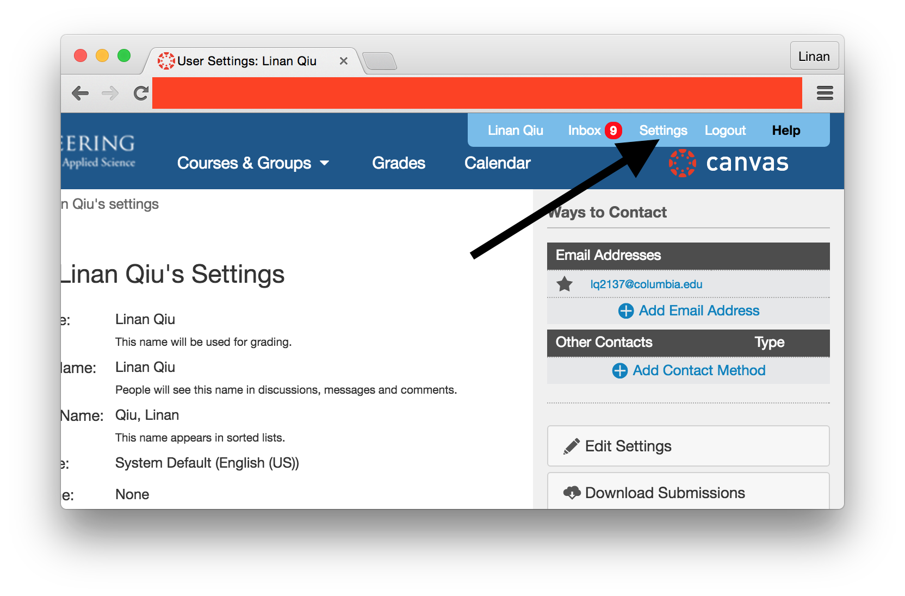
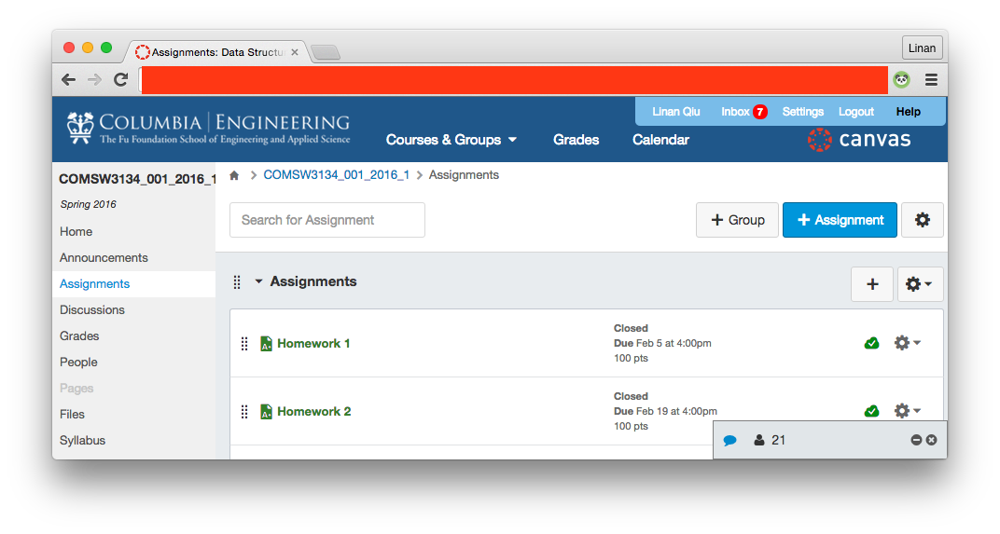
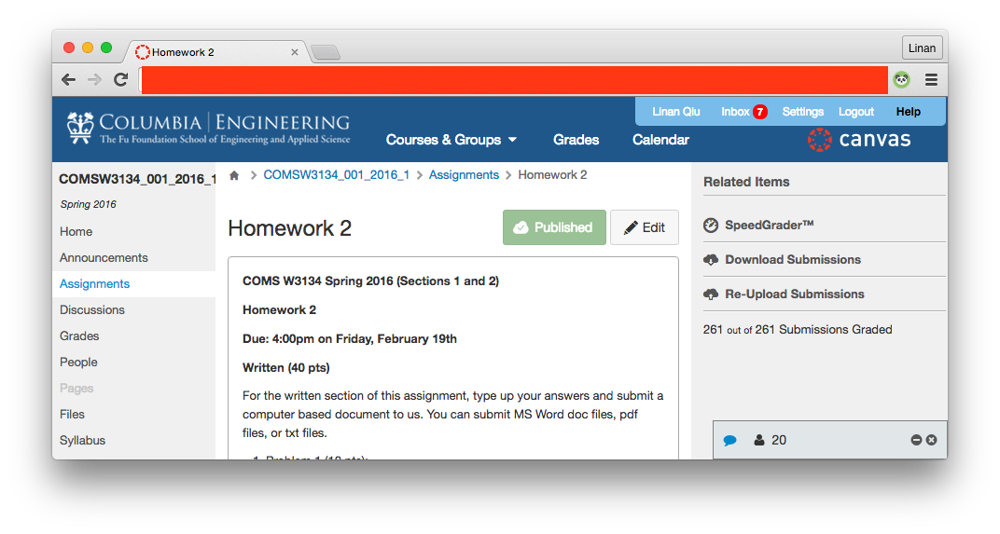
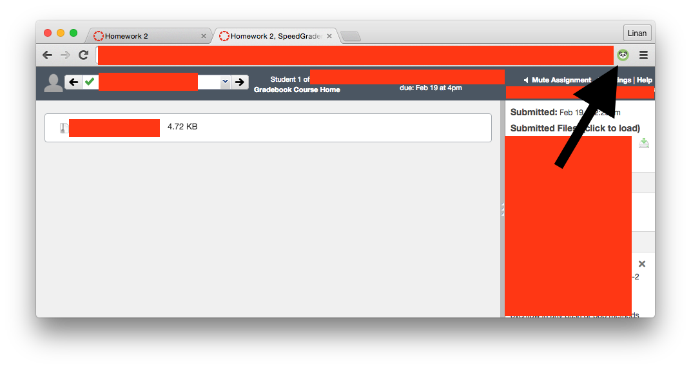

# Canvas Submission Time Scraper

Canvas is kind of clunky when it comes to exporting data. Furthermore, many profs like to give grace days / hours / minutes (because they're nice people unlike me) even after submissions are due. Then, they'll have to manually mark submissions as "on-time" even though Canvas marks them late.

Canvas **currently does not export student assignment submission times**. That can be annoying for classes / professors / TAs that work on a grace day system (like mine). Wouldn't it be nice to export each student's submission time as a CSV file for a given assignment?

This is what we do.

## Quick Start

There are two ways to do this. The first **via Canvas API in Python** and the second **via a Chrome Extension that screen scrapes**. Obviously the first is superior, though I coded the second one earlier. The Chrome extension will no longer be updated / maintained.

### Python

#### Getting an Access Token

Download `canvas-panda.py` in this repo. Why did I name it panda? Because pandas are cute.

Log in to courseworks2 at [https://courseworks2.columbia.edu/](https://courseworks2.columbia.edu/) and get yourself an **access token** by going to settings:



And get yourself a new access token. **Copy it down**.


#### Profit

Now get submission times by running `canvas-panda.py` with the following arguments:

```bash
$ python canvas-panda.py <API_KEY> <Course_ID> <Assignment_ID>
```

You can find the Course ID and Assignment ID from the URL of the assignment: `https://courseworks2.columbia.edu/courses/xxxx/assignments/yyyy` where `xxxx` is the course ID and `yyyy` is the assignment ID.

The results will be saved in a .csv file these columns:

- Student's name
- Student's UNI
- Students `user_id` (used by Canvas)
- Student's submission time in Google Spreadsheet's default format

### Chrome Extension

**THIS WILL NO LONGER BE UPDATED AND IS NOT THE PREFERRED WAY OF DOING THIS.** Please use the Python script above.

#### Installation

To install this **Chrome Extension**

- Download this entire repo as a `.zip` and unpack it
- Go to `chrome://extensions` on Chrome
- Check `Developer Mode`
- Click on `Load unpacked extension...` and select the folder for the repo
- Green panda should appear and you can use it as described above.

#### Usage

Navigate to **Speed Grader** for the homework you'd like to export.

That is, go to **Assignments** on the side bar.



Click on the homework you'd want to export.



Click on **Speed Grader** and allow the page to load.


Now click on the green panda and wait. **Chrome may tell you that the page has frozen and tell you that you should kill it. Don't. It is simply clicking through all (possibly hundreds) of students to get their submission times**.



A "save as" dialog will pop up asking you to download `submission_times.csv`. Download `submission_times.csv` and profit.

Unfortunately, we are not able to cross reference UNIs from student names and student IDs because Canvas. You'll have to cross reference them on your own from gradebook exports. That's trivial using either spreadsheet functions (`VLOOKUP`) or a simple script.
